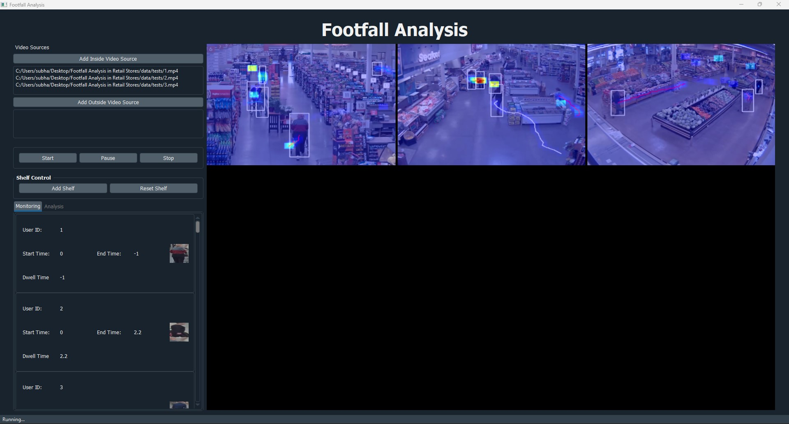
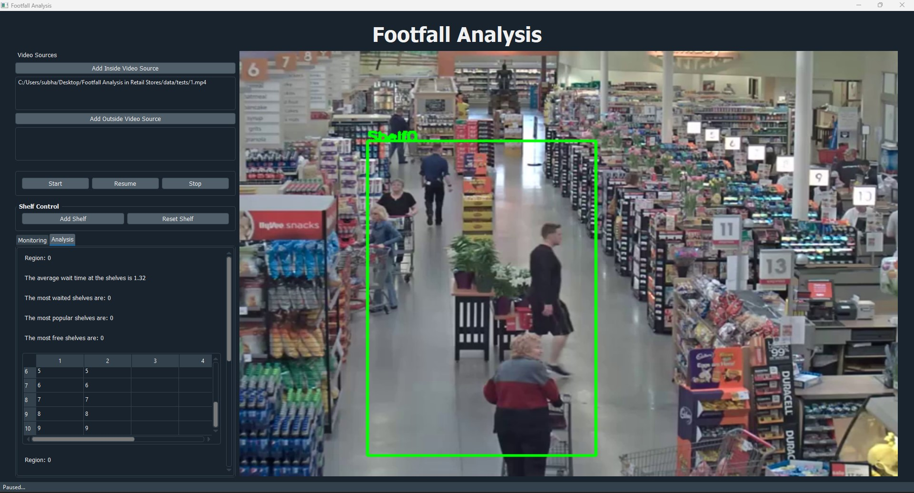

# Footfall-Analysis-in-Retail-Stores

### Análisis de afluencia de clientes en tiempo real en tiendas minoristas

- Análisis de afluencia en tiempo real (soporta múltiples flujos de video, p. ej. cámaras IP o webcam) desde una aplicación de escritorio.
- Cálculo de métricas demográficas como tiempos de permanencia / mapas de calor en una ubicación concreta, p. ej. cerca de los estantes.
- Personalización del plano de la tienda, p. ej. control por estante.
- Detección de personas (usando YOLO) junto con detección de edad/género cuando aplica.
- Seguimiento del recorrido de los clientes en la tienda.
- Los datos de análisis también se guardan en los registros (logs).

**Ejecución de ejemplo con múltiples flujos de video, detección/seguimiento de clientes y tiempos de permanencia / mapas de calor:**

<div align="center">
    
</div>

**Ejecución de ejemplo con control de estantes:**

<div align="center">
    
</div>

> NOTA: Este proyecto es experimental y no se mantiene activamente. Si encuentras errores o problemas, abre una issue.

---

## Índice

* [Ejecutar la aplicación](#ejecutar-la-aplicación)
    - [Instalar las dependencias](#instalar-las-dependencias)
    - [Descargar los modelos](#descargar-los-modelos)
    - [Ejecutar la aplicación de escritorio](#ejecutar-la-aplicación-de-escritorio)
* [Compilar una aplicación de escritorio independiente (PyInstaller)](#compilar-una-aplicación-de-escritorio-independiente-pyinstaller)
* [Archivos de modelo](#archivos-de-modelo)
* [Stack tecnológico](#stack-tecnológico)
* [Referencias](#referencias)
* [Créditos](#créditos)

---

## Ejecutar la aplicación

### Instalar las dependencias

Requiere **Python 3.11** (probado en Windows 10/11). Crea un entorno virtual e instala las dependencias: ```
python -m venv .venv
.venv\Scripts\python -m pip install -r requirements.txt
```

Las dependencias en tiempo de ejecución son ligeras: PyQt5, OpenCV (`opencv-python<5`), NumPy, SciPy, Pillow y QDarkStyle.
**Ya no se usa TensorFlow/Keras/scikit-learn** — la inferencia de YOLO y el codificador de re-identificación MARS
corren sobre el módulo DNN de OpenCV, y la asignación de detecciones a tracks usa el solver húngaro de SciPy.

> NOTA: `opencv-python` debe mantenerse por debajo de 5.x — OpenCV 5 eliminó `cv2.dnn.readNetFromDarknet`.

### Descargar los modelos

Los archivos de modelo grandes (~342 MB) **no están en git**; se listan en `models.txt`
(sha256 + tamaño + URL) y se descargan bajo demanda: ```
python scripts/download_models.py          # descarga lo que falta (verifica sha256)
python scripts/download_models.py --check  # solo verifica (exit 1 si falta algo)
python scripts/download_models.py --force  # vuelve a descargar todo
```

Ejecutar la aplicación desde el código fuente (`python footfall.py`) hace esto automáticamente
en el primer arranque, así que un clon nuevo solo necesita `pip install -r requirements.txt` + acceso a internet.
El exe empaquetado no descarga nada — los modelos se incluyen en el momento de compilar, así que ejecuta
el script de descarga una vez antes de `pyinstaller`.

### Ejecutar la aplicación de escritorio

La aplicación de escritorio funciona con PyQt, ejecútala con: ```
.venv\Scripts\python footfall.py
```
O más fácil: doble clic en **`run.bat`** — crea el entorno virtual si falta, instala las dependencias,
descarga los modelos que falten y lanza la aplicación.

Elige un archivo de video (hay muestras en `data/tests/`), la webcam o la URL de una cámara IP en el diálogo de dispositivo y pulsa Aceptar.
Los registros (CSV) se escriben en `data/logs/` bajo el directorio de trabajo actual.

---

## Compilar una aplicación de escritorio independiente (PyInstaller)

O más fácil: doble clic en **`build.bat`** — prepara el entorno, verifica/descarga los modelos,
compila con PyInstaller y deja la aplicación lista en `dist\ShoppingAnalytics\`.

Los usuarios finales no necesitan Python — la aplicación se puede empaquetar en una carpeta autónoma con: ```
python -m pip install pyinstaller
pyinstaller --noconfirm --clean --windowed --name ShoppingAnalytics ^
  --add-data "ui;ui" ^
  --add-data "processor\detectracker\yolov3.cfg;processor\detectracker" ^
  --add-data "processor\detectracker\model_data\yolov3.weights;processor\detectracker\model_data" ^
  --add-data "processor\detectracker\model_data\mars-small128-opencv.pb;processor\detectracker\model_data" ^
  --add-data "processor\detectracker\model_data\coco_classes.txt;processor\detectracker\model_data" ^
  --add-data "processor\agender\opencv_face_detector.pbtxt;processor\agender" ^
  --add-data "processor\agender\opencv_face_detector_uint8.pb;processor\agender" ^
  --add-data "processor\agender\model;processor\agender\model" ^
  footfall.py
```
(En Linux/macOS usa `:` en lugar de `;` en `--add-data`.)

Resultado: `dist\ShoppingAnalytics\ShoppingAnalytics.exe`. Distribuye la carpeta `ShoppingAnalytics`
completa (el ejecutable necesita los recursos de `_internal\` junto a él).

Las rutas de recursos se resuelven mediante `paths.py`:
- `resource_path()` — archivos de modelo/UI de solo lectura, empaquetados en el exe.
- `output_path()` / `ensure_output_dirs()` — `data/logs/` escribible bajo el directorio de trabajo actual.

---

## Archivos de modelo

Los archivos pequeños (configs, listas de clases, el codificador MARS convertido) están versionados en el repo;
los pesados se descargan desde `models.txt` con `scripts/download_models.py` y se
verifican con sha256:

| Componente | Archivo | Versionado | Origen |
|---|---|---|---|
| Detector de personas | `processor/detectracker/yolov3.cfg` + `model_data/yolov3.weights` (248 MB) | cfg sí / weights **descargado** | [YOLOv3 (pjreddie.com)](https://pjreddie.com/media/files/yolov3.weights) |
| Clases de detección | `processor/detectracker/model_data/coco_classes.txt` | sí | 80 clases COCO |
| Codificador Re-ID (MARS) | `model_data/mars-small128-opencv.pb` (11 MB) | sí | convertido desde el Keras `mars-small128.pb` para correr en `cv2.dnn`; el original [mars-small128.pb](https://raw.githubusercontent.com/saimj7/Shopping-Analytics/master/processor/detectracker/model_data/mars-small128.pb) (**descargado**, solo como referencia) proviene del proyecto original |
| Detector facial | `processor/agender/opencv_face_detector_uint8.pb` (2.7 MB) + `.pbtxt` | pbtxt sí / pb **descargado** | [OpenCV Zoo face detector](https://github.com/opencv/opencv_zoo) reflejado en [smahesh29/Gender-and-Age-Detection](https://github.com/smahesh29/Gender-and-Age-Detection) |
| Clasificador edad/género | `model/age_net.caffemodel` + `gender_net.caffemodel` (45 MB cada uno) + `deploy_*2.prototxt` | prototxt sí / caffemodel **descargado** | [GilLevi/AgeGenderDeepLearning](https://github.com/GilLevi/AgeGenderDeepLearning) reflejado en [smahesh29/Gender-and-Age-Detection](https://github.com/smahesh29/Gender-and-Age-Detection) |
| Videos de muestra | `data/tests/*.mp4` (41 MB) | sí | material de prueba de este proyecto |

Para agregar un nuevo recurso: añade una línea a `models.txt` (`sha256  tamaño_en_bytes  destino  url`).

---

## Stack tecnológico

- **UI:** PyQt5 + QDarkStyle (`footfall.py`, `windows/`, `ui/*.ui`)
- **Detección / seguimiento:** YOLOv3 vía `cv2.dnn` + DeepSORT (`processor/detectracker/`)
- **Edad y género:** modelos Caffe de OpenCV DNN (`processor/agender/`)
- **Asignación:** `linear_sum_assignment` de SciPy (`processor/detectracker/deep_sort/linear_assignment.py`)
- **Analítica:** heatmap, tiempo de permanencia, distribución por género (`analyser/`)

---

## Referencias

- [YOLOv3](https://pjreddie.com/darknet/yolov3/)
- [DeepSORT (nwojke/deep_sort)](https://github.com/nwojke/deep_sort)
- [AgeGenderDeepLearning (GilLevi)](https://github.com/GilLevi/AgeGenderDeepLearning)

---

## Créditos

Este proyecto se basa en el repositorio original **[saimj7/Shopping-Analytics](https://github.com/saimj7/Shopping-Analytics)**
(*Footfall-Analysis-in-Retail-Stores*, autor: <a href="http://saimj7.github.io" target="_blank">Sai_Mj</a>).

Modificaciones de esta versión: migración a Python 3.11, reemplazo de TensorFlow/Keras/scikit-learn
por OpenCV DNN + SciPy, descarga de modelos bajo demanda (`models.txt` + `scripts/download_models.py`),
compilación con PyInstaller y pura limpieza del historial de git.

---

*saimj7/ 14-06-2020 - ✎ <a href="http://saimj7.github.io" target="_blank">Sai_Mj</a>.*
